# Подготовка к использованию

1. Установите Python версии 3.8+

2. Установите последний релиз проекта

3. Запустите проект нажатием на файл с расширением .exe (исполняемый файл)

4. В случае проблемы обратитесь к разработчику лично или напишите issue на GitHub (возможно, придётся устанавливать пакеты с помощью команды pip install -r requirements.txt используя терминал)

# Инструкция по использованию

1. Запустите проект

2. При необходимости настройте диапазон, на котором определены функции phi(x) и psi(x)
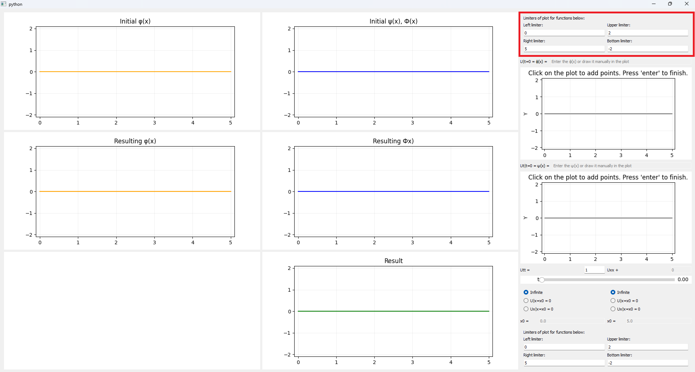

3. Ввведите фунции phi(x), psi(x) по точкам. Левая кнопка мыши - ввести новую точку, backspace - удалить самую правую точку, space \ enter - завершить ввод
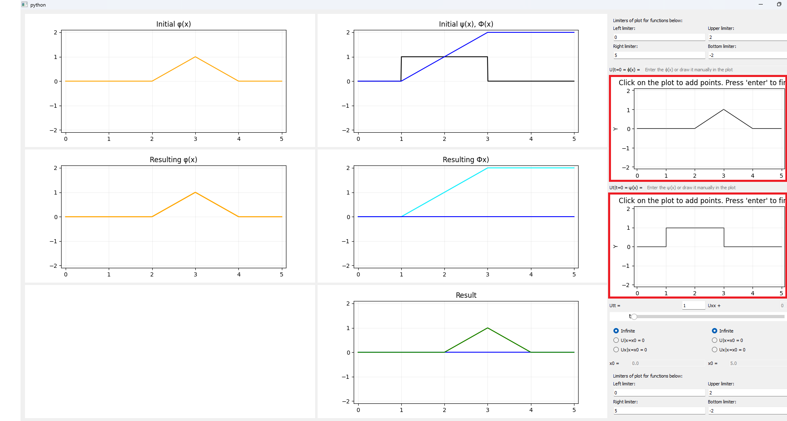

4. При необходимости настройте параметр а^2
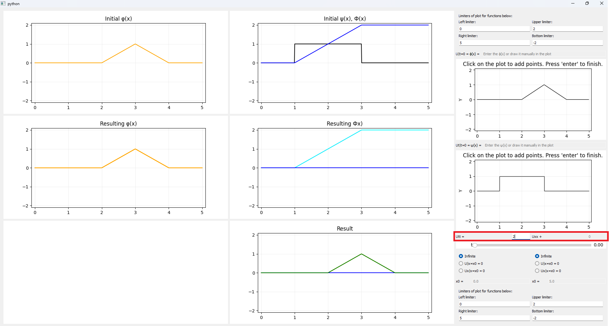

5. При необходимости выберите вид ограничений струны слева и справа в соответсвующих окнах
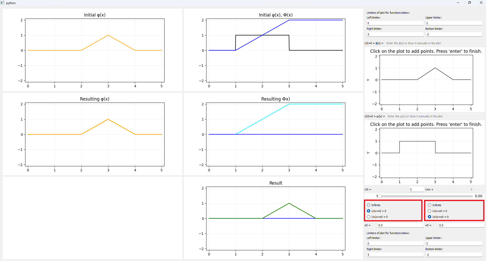

6. При необходимости измените точки, в которых ограничена струна
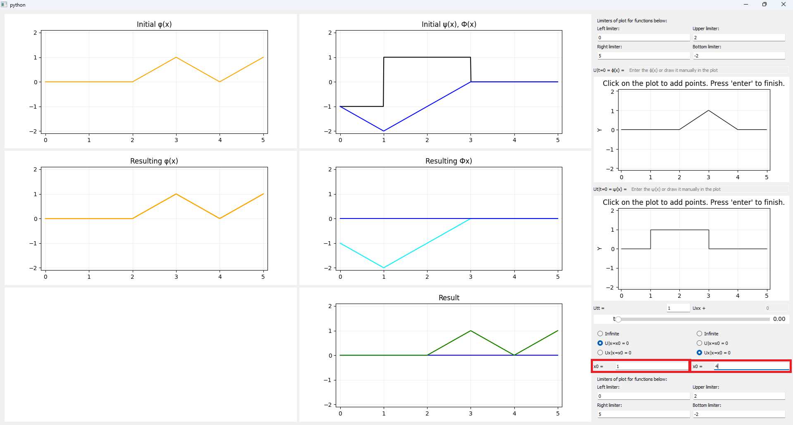

7. При необходимости настройте диапазон, на котором отображаются результиующие графики
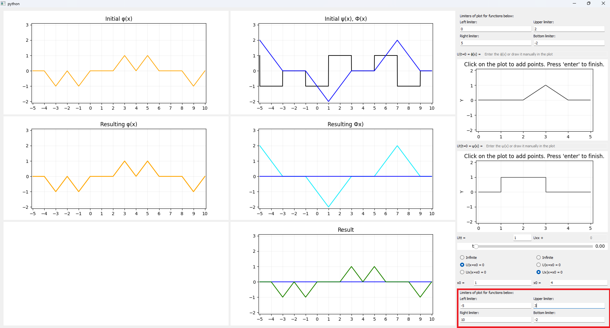

8. Измените параметры t
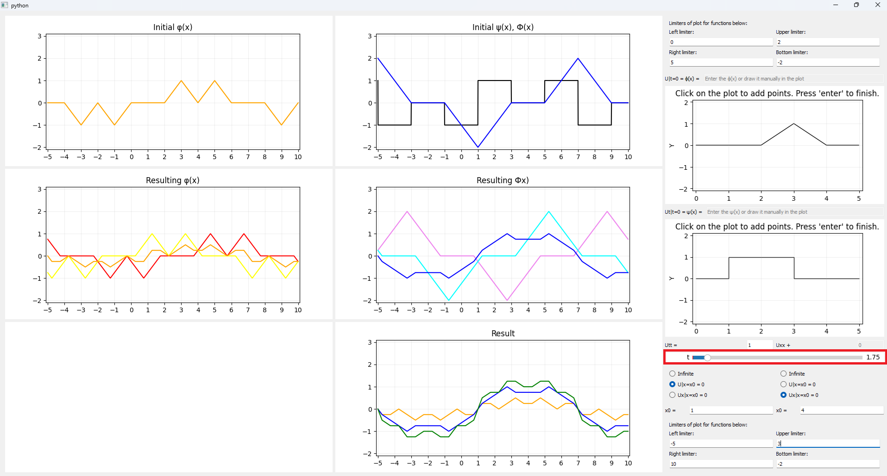

9. Оранжевый график тут - график phi(x)
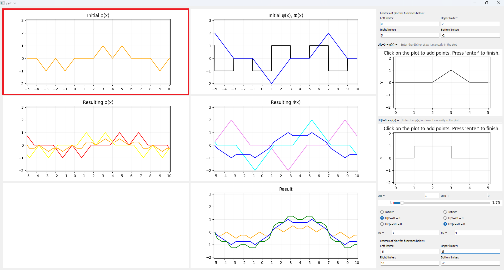

10. Чёрный график - график psi(x), синий - график интеграла от psi(u)du с переменным верхним пределом x (Ф(x))
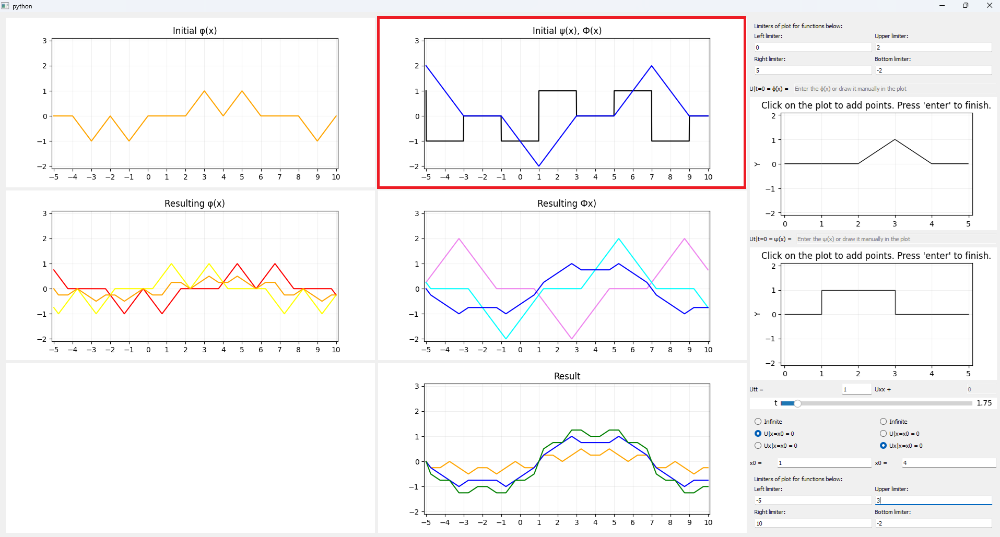

11. Желтый график - график phi(x+at), красный - график psi(x-at), оранжевый - график 1/2 (phi(x+at) + phi(x-at))
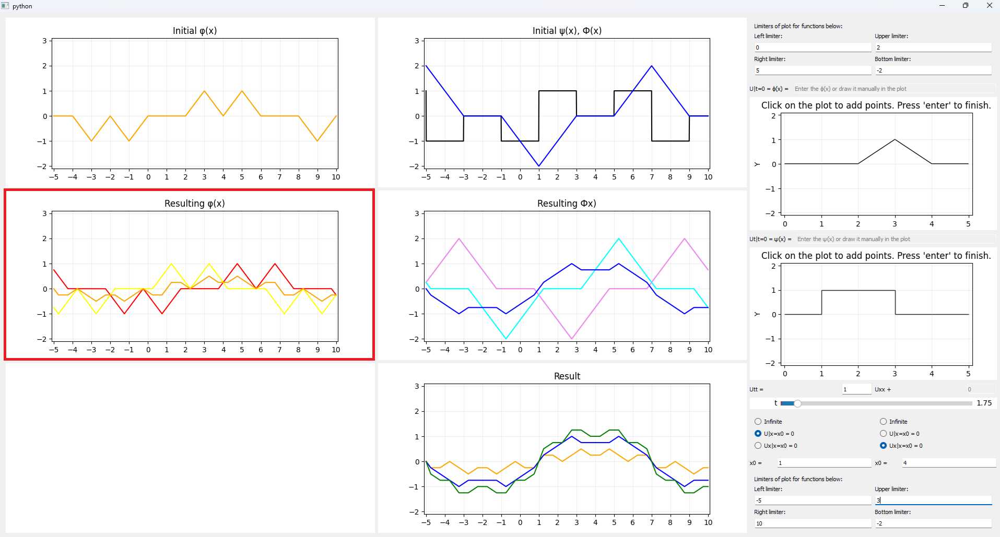

12. Бирюзовый график - график Ф(x+at), фиолетовый - график Ф(x-at), синий - график 1/2a (Ф(x+at) - Ф(x-at))
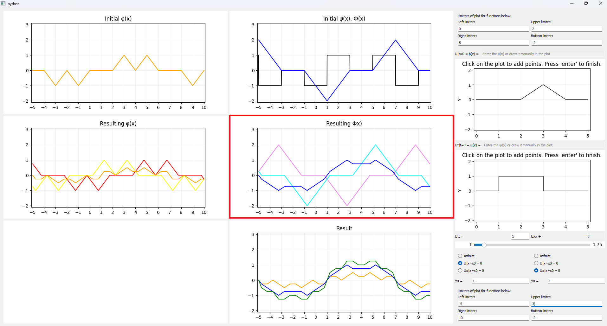

13. Оранжевый график - график 1/2 (phi(x+at) + phi(x-at)), синий - график 1/2a (Ф(x+at) - Ф(x-at)), зелёный - график итоговой функции U(x, t)
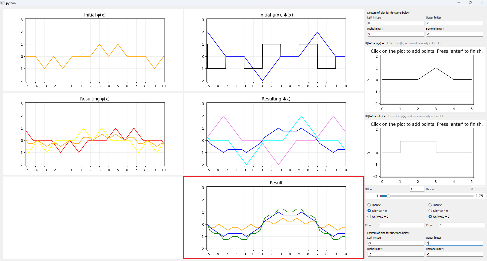

# Подготовка к работе с проектом в IDE

1. Установите Python версии 3.8+

2. Клонируйте репозиторий используя команду git clone "url репозитория" или иным образом сохраните его локально (кавычки не нужны)

3. Откройте терминал

4. В терминале перейдите в директорию с проектом с помощью cd "абсолютный путь к директории с проектом" (кавычки не нужны)

5. Установите виртуальное окружение с помощью команды python -m venv venv

6. Активируйте виртуальное окружение с помощью команды source venv/bin/activate

7. Установите зависимости с помощью команды pip install -r requirements.txt

8. Запустите проект с помощью команды python main.py

# Инзвестные проблемы

- Обновление диапазона графика при смене параметра t происходит не всегда 

- Плохая оптимизация при большом количестве сегментов

- Не реализовано решение неоднородного уравнения струны

- После изменения размеров окна невозможно ввести точки для ручного ввода негладкой функции phi(x)

- Не реализован ввод гладкой функции phi(x)

- Не реализован ввод гладкой функции psi(x)

- Интегрирование psi(x) вряд ли работает с нелинейными сегментыми функции

- Некрасивый интерфейс

- Неизменяемый масштаб графиков (сетка не квадратная)

- Плохая видимость графиков и невозможность их приблизить
